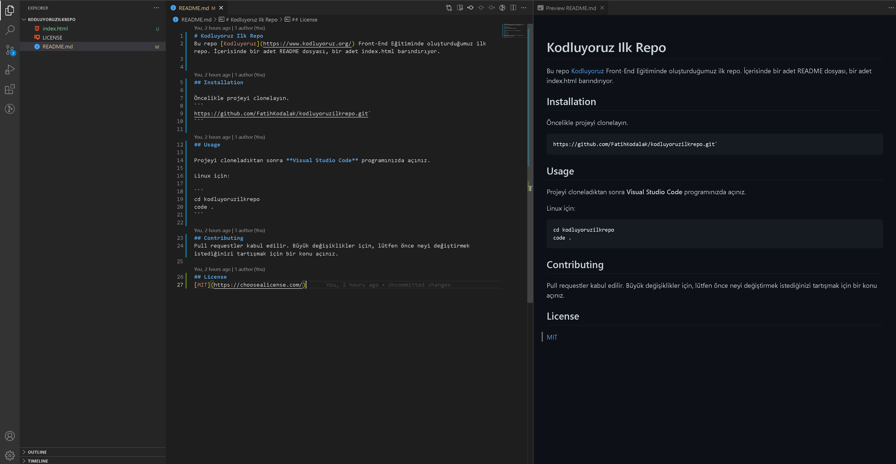

# Kodluyoruz Ilk Repo
Bu repo [Kodluyoruz](https://www.kodluyoruz.org/) Front-End Eğitiminde oluşturduğumuz ilk repo. İçerisinde bir adet README dosyası, bir adet index.html barındırıyor.
---
[](https://github.com/FatihKodalak/kodluyoruzilkrepo)
---

## Installation

Öncelikle projeyi clonelayın.
```
https://github.com/FatihKodalak/kodluyoruzilkrepo.git`
```

## Usage

Projeyi cloneladıktan sonra **Visual Studio Code** programınızda açınız.

Linux için:

```
cd kodluyoruzilkrepo
code .
```

## Contributing
Pull requestler kabul edilir. Büyük değişiklikler için, lütfen önce neyi değiştirmek istediğinizi tartışmak için bir konu açınız.

## License
[MIT](https://choosealicense.com/)